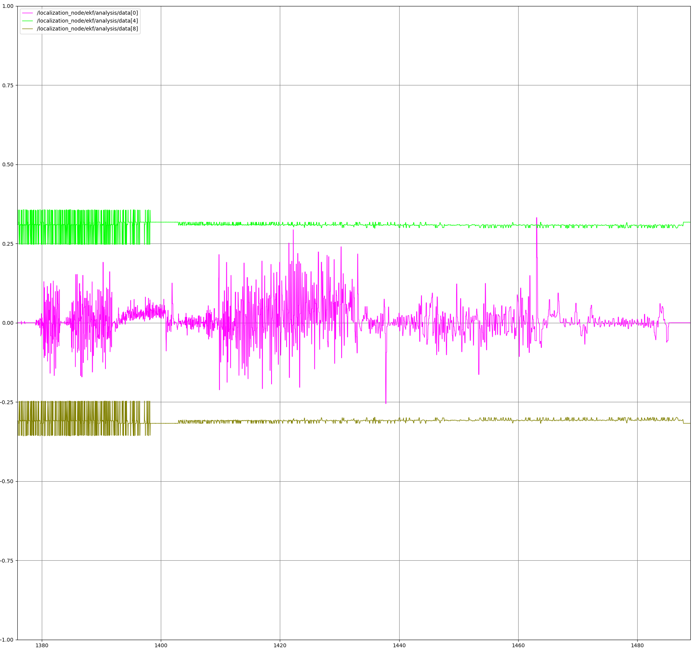
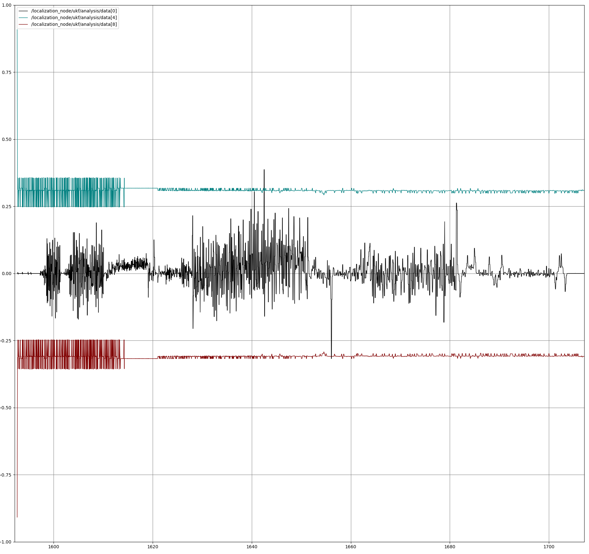

## Assignment Implementation: EE5531 Project 4
**Authors:** Anders Smitterberg and Reid Beckes

# Project 4: State Estimation (KF, EKF, UKF)
This repository contains a ROS 2 node that implements three distinct methods for robot state estimation: **Linearized Kalman Filter (KF)**, **Extended Kalman Filter (EKF)**, and **Unscented Kalman Filter (UKF)**. The node fuses data from commanded velocities (`/cmd_vel`), wheel encoders (`/joint_states`), and IMU measurements (`/imu`) to estimate the robot's pose and path.

### Prerequisites
* Ubuntu 24.04 or Linux Mint 22.3 or WSL (untested)
* ROS 2 Jazzy
* `rosbag2_2026_02_03-15_36_14` recorded data folder

### Initial Setup and Testing
1. **Create and enter a new ROS 2 workspace:**
    ```bash
    mkdir -p ~/proj4_ws/src
    cd ~/proj4_ws/src
    ```
2. **Clone the repository:**
    ```bash
    git clone https://github.com/Robust-Autonomous-Systems-Laboratory/proj4_group1
    git submodule update --init --recursive
    ```
3. **Install dependencies:**
    ```bash
    cd ~/proj4_ws
    rosdep install -i --from-path src --rosdistro jazzy -y --os=ubuntu:noble
    ```
4. **Build the workspace:**
    ```bash
    colcon build --symlink-install
    ```
5. **Source the environment:**
    ```bash
    source install/setup.bash
    ```
6. **Launch the Localization System:**
    * This starts the `localization_node` and `RViz2` with the correct configuration:
        ```bash
        ros2 launch jasmitte_proj4 localization.launch.py
        ```
7. **Play the rosbag:**
    * In a separate terminal (remember to source `install/setup.bash`), play the data with clock emulation:
        ```bash
        ros2 bag play src/rosbag2_2026_02_03-15_36_14 --clock
        ```
8. **Analysis (rqt_plot):**
    * Each filter (KF, EKF, UKF) publishes a `Float64MultiArray` with **17 elements** to its respective `/analysis` topic.
    
    * **Data Index Map:**
        | Index | Field | Description |
        | :--- | :--- | :--- |
        | `data[0]` | IMU $\omega$ Residual | Angular velocity error (rad/s) |
        | `data[1]` | IMU $a_x$ Residual | Linear acceleration error (m/s²) |
        | `data[2]` | Wheels $v$ Residual | Linear velocity error (m/s) |
        | `data[3]` | Wheels $\omega$ Residual | Angular velocity error (rad/s) |
        | `data[4]` | IMU $\omega$ $+3\sigma$ Bound | Upper boundary for data[0] |
        | `data[5]` | IMU $a_x$ $+3\sigma$ Bound | Upper boundary for data[1] |
        | `data[6]` | Wheels $v$ $+3\sigma$ Bound | Upper boundary for data[2] |
        | `data[7]` | Wheels $\omega$ $+3\sigma$ Bound | Upper boundary for data[3] |
        | `data[8]` | IMU $\omega$ $-3\sigma$ Bound | Lower boundary for data[0] |
        | `data[9]` | IMU $a_x$ $-3\sigma$ Bound | Lower boundary for data[1] |
        | `data[10]`| Wheels $v$ $-3\sigma$ Bound | Lower boundary for data[2] |
        | `data[11]`| Wheels $\omega$ $-3\sigma$ Bound | Lower boundary for data[3] |
        | `data[12]`| $\sigma^2_x$ | Variance in X position |
        | `data[13]`| $\sigma^2_y$ | Variance in Y position |
        | `data[14]`| $\sigma^2_\theta$ | Variance in Heading |
        | `data[15]`| $\sigma^2_v$ | Variance in Linear Velocity |
        | `data[16]`| $\sigma^2_\omega$ | Variance in Angular Velocity |

    * **Plotting Residuals with Bounds:**
        To plot a residual (e.g., IMU $\omega$) with its full $3\sigma$ envelope, add the following to `rqt_plot`:
        ```text
        /localization_node/ekf/analysis/data[0]
        /localization_node/ekf/analysis/data[4]
        /localization_node/ekf/analysis/data[8]
        ```
---

### 1. State Space and Algorithm Modeling
The system uses a 5-state Velocity-State model to allow direct fusion of accelerometers and gyroscopes.

*   **State Vector ($x$):**
    $$ x = \begin{bmatrix} x & y & \theta & v & \omega \end{bmatrix}^T $$
    *   $x, y$: Robot position in global frame (meters)
    *   $\theta$: Robot heading (radians)
    *   $v$: Linear velocity (m/s)
    *   $\omega$: Angular velocity (rad/s)

*   **Process Model ($f(x, u)$):**
    Predicts the next state based on current state and control inputs ($v_{cmd}, \omega_{cmd}$).
    $$
    ```bash
    x_{k+1} = \begin{bmatrix}
    x_k + v_k \cos(\theta_k) \Delta t \\
    y_k + v_k \sin(\theta_k) \Delta t \\
    \theta_k + \omega_k \Delta t \\
    v_k + (v_{cmd} - v_k) \frac{\Delta t}{\tau} \\
    \omega_k + (\omega_{cmd} - \omega_k) \frac{\Delta t}{\tau}
    \end{bmatrix}
    $$

#### Kalman Filter (KF/EKF) Matrices

*   **Process Jacobian ($F$):**
    Linearized around the current state estimate for both KF and EKF.
    $$
    F = \frac{\partial f}{\partial x} = \begin{bmatrix}
    1 & 0 & -v_k \sin(\theta_k) \Delta t & \cos(\theta_k) \Delta t & 0 \\
    0 & 1 & v_k \cos(\theta_k) \Delta t & \sin(\theta_k) \Delta t & 0 \\
    0 & 0 & 1 & 0 & \Delta t \\
    0 & 0 & 0 & 1 - \Delta t/\tau & 0 \\
    0 & 0 & 0 & 0 & 1 - \Delta t/\tau
    \end{bmatrix}
    $$

*   **Measurement Model:**
    The system fuses both Wheel Encoders and IMU in the **Rate Domain**.

    **1. IMU Measurement:**
    *   **Measurement Vector ($z_{imu}$):** $[\omega, a_x]^T$
    *   **Observation Model ($h_{imu}(x)$):**
        $$ h_{imu}(x) = \begin{bmatrix} \omega \\ (v_{cmd} - v) / \tau \end{bmatrix} $$
    *   **Jacobian ($H_{imu}$):**
        $$ H_{imu} = \begin{bmatrix} 0 & 0 & 0 & 0 & 1 \\ 0 & 0 & 0 & -1/\tau & 0 \end{bmatrix} $$

    **2. Wheel Encoder Measurement:**
    *   **Measurement Vector ($z_{wheels}$):** $[v, \omega]^T$
    *   **Observation Model ($h_{wheels}(x)$):**
        $$ h_{wheels}(x) = \begin{bmatrix} v \\ \omega \end{bmatrix} $$
    *   **Jacobian ($H_{wheels}$):**
        $$ H_{wheels} = \begin{bmatrix} 0 & 0 & 0 & 1 & 0 \\ 0 & 0 & 0 & 0 & 1 \end{bmatrix} $$

#### Unscented Kalman Filter (UKF)
The UKF uses the same process ($f$) and measurement ($h$) models but propagates sigma points using the transform.

*   **Sigma Point Parameters:**
    *   $\alpha = 0.1$
    *   $\beta = 2.0$
    *   $\kappa = 0.0$

---

### 2. Results and Analysis

#### 2a. ROS 2 and RViz Visualization
*   **Demonstration Video Including Covariance:** <video controls src="screen_rec_cropped.mp4" title="Title"></video>


*Current visualization of the three paths (Red: KF, Green: EKF, Blue: UKF)*

#### 2b. Understanding of the Residual
*Plot each residual (including +/- 3 sigma bounds) at each time step for each algorithm.*

*   **KF Residuals:** 
*   **EKF Residuals:** 
*   **UKF Residuals:** 
  
All three filters demonstrated proper residual behavior. The residuals appeared white with zero mean and little autocorrelation. When the mean begins to drift away from zero it is driven back to zero indicating the Kalman gain is correctly applying to the residual.

#### 2c. Algorithm Tuning
*select one algorithm and compare badly tuned vs. well-tuned performance.*

*   **Selected Algorithm:** ...
*   **Poorly Tuned Plot:** [add our plots]
*   **Well-Tuned Plot:** [add our plots]
*   **Tuning Explanation:** ...

#### 2d. Covariance Stability
*Plot diagonal elements of the state covariance matrix without using measurement.*

*   **KF Covariance (No Measurements):** [add our plots]
*   **EKF Covariance (No Measurements):** [add our plots]
*   **UKF Covariance (No Measurements):** [add our plots]
*   **Stability Analysis:** ...
*   **Improvement Strategy:** ...

#### 2e. Ground Truth Evaluation
*compute the aboslute error from the ending and starting positions. this is just the initial position minus the final position*

| Algorithm | Trans. Error (m) | Rot. Error (rad) |
|-----------|------------------|------------------|
| KF        |                  |                  |
| EKF       |                  |                  |
| UKF       |                  |                  |

*   **Best Performing Filter:** ...

---

### 3. Engineering Decision
*select our best algorithm and describe why.*

*   **Winning Algorithm:** ...
*   **Reasoning:** ...

---

### 4. Future Improvements
The most important improvement to this localization system is to include a map. If the robot has an understanding of what its environmet is it can relate itself to that environment based on sesnor information it has. Combining the map with more sensor data can also improve the localization. Here, the robot is directly measuring its environment and relating features it detects to the map its has. This gets into the realm of simultaneous localization and mapping.

A more direct improvement to this system would be better characterization of covariance for both the process noise (Q) and the measurement noise (R). These parameters where tuned based off of intuition but a proper calculation would improve the filter's path. The process noise covariance (Q) could be better characterized by incoporating the varaiance of the acceleration which would act like noise on our position and velocity measurements. To improve the the measurement noise covariance characterization (R), tests would need to be done with those sensors to find their characteristics.

---

### References
* Differential Kinematics: [Wikipedia: Differential wheeled robot](https://en.wikipedia.org/wiki/Differential_wheeled_robot)
* Kalman Filtering: [Wikipedia: Kalman filter](https://en.wikipedia.org/wiki/Kalman_filter)
* Non-linear Filtering (EKF/UKF): [Wikipedia: Non-linear filters](https://en.wikipedia.org/wiki/Kalman_filter#Nonlinear_filters)
* Cholesky Decomposition: [Wikipedia: Cholesky decomposition](https://en.wikipedia.org/wiki/Cholesky_decomposition)
* Robot Parameters : [Turtlebot3: Documentation](https://emanual.robotis.com/docs/en/platform/turtlebot3/features/)

### AI Disclosure
Google Gemini was used to assist with the implementation of the Kalman Filter algorithms (KF, EKF, UKF), formatting the Python node structure, and establishing the ROS 2 launch and analysis topic configurations.
